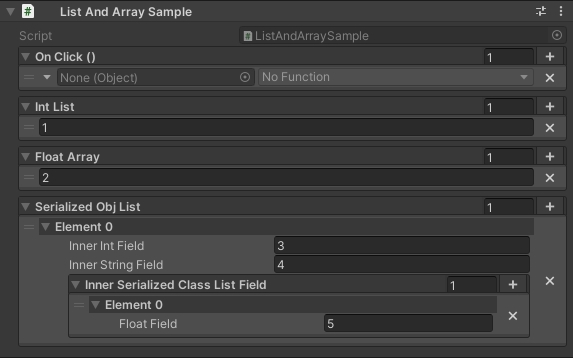
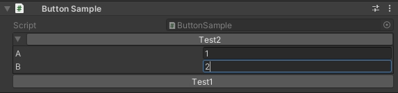
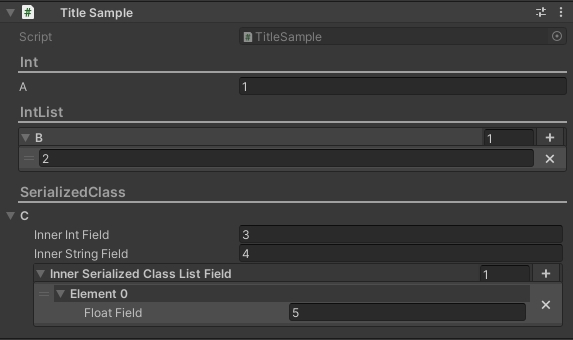
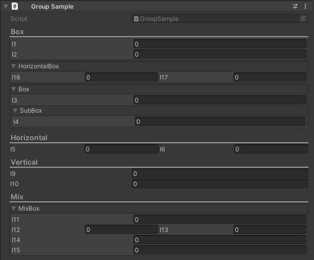
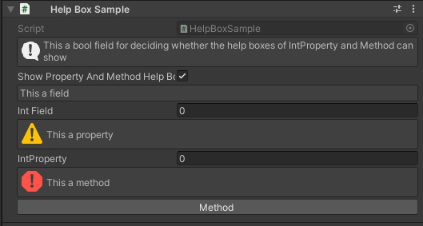


# LBLibraryUnityEditor

一些UnityEditor便捷工具的集成工程，目前预计包含有以下内容：

[OdinInspector]("https://odininspector.com/") 的部分Attribute及功能

[SmartInspector]("https://github.com/neon-age/Smart-Inspector") 全部功能

[MyBox]("https://github.com/Deadcows/MyBox") 的部分Attribute

### 接管Unity的Inspector绘制

实现原理：相关Inspector的绘制只继续使用Unity的`PropertyField`方法，其余全部进行代为处理，接管的包含MonoBehavior和ScriptableObject。Property的绘制则是再绘制一遍SerializedProperty，只是会监控它的变更来执行对应的Set方法.支持Serializable的类绘制属性和方法

### 更新履历
2022.5.18
+ 优化性能

2022.4.13
+ 干掉Smart Inspector，太久没维护了，bug太多

2022.4.8
+ 适配2019.4
+ 跟着Unity修复2021.2下的列表只绘制可视区域但计算貌似有问题的Bug
+ 修复Unity2019下ReorderableList的defaultBehaviour不会自动创建的Bug

2022.2.21
+ 修复若干bug

2022.1.26
+ 新增DisplayName

2022.1.21
+ 2021.2版本下不启用SmartInspector的UIElement绘制

2022.1.20
+ 新增HelpBox

2022.1.14
+ 重构框架
+ 支持Serializable的属性和方法绘制
+ 暂时停用SmartInspector的UIElement绘制，等待Bug解决后再开启

2022.1.7
+ 优化框架
+ Property的机制重做，还是得依赖于SerializedProperty
+ 新增一些Attribute默认根据行号排序
+ 新增ShowIf和HideIf
+ 新增Box、Horizontal和Vertical

2021.12.31
+ 支持部分不需要反射的Unity内的PropertyDrawer
+ 支持字段的多选编辑
+ 优化性能

2021.12.24
+ 疯狂优化性能

2021.12.22
+ 依旧还是得使用反射支持绘制PropertyDrawer和DecoratorDrawer

2021.11.26
+ 平台组内部使用Beta版：
    + 重写Array和List的绘制 
    + 显示属性
    + 显示方法按钮
    + Title特性

#### Array和List

Array和List采用Unity自带的ReorderableList进行绘制



#### Property

支持用`[ShowInInspector]`显示Property，并修改会相应执行Set方法，非Public的Set方法会禁止进行编辑

另外`[ShowInInspector]`自带默认传入行号来进行排序，推荐给字段也加上这个特性来一并排序，不然排序可能紊乱

```c#
[ShowInInspector, Delayed]public float floatField;

[ShowInInspector("floatField")]
public float FloatProperty
{
    get => floatField;
    set
    {
        Debug.Log("Delayed set float field value" + value);
        floatField = value;
    }
}
[ShowInInspector, SerializeField] private int readonlyIntField;

[ShowInInspector("readonlyIntField")]
public int ReadonlyIntProperty
{
    get => readonlyIntField;
    private set => readonlyIntField = value;
}
```

#### Button

支持将一个非静态的方法在面板上显示为一个按钮，支持编辑和执行带参数的方法

```c#
[Button]
public void Test1()
{
    Debug.Log("Test1");
}

[Button]
public void Test2(string a, float b)
{
    Debug.Log("Test2 " + a + " " + b);
}
```



#### Title

```c#
[Title("Int")] public int a = 1;
[Title("IntList")] public List<int> b = new List<int>();
[Title("SerializedClass")] public SerializedClassSample c = new SerializedClassSample();
```



#### ShowIf/HideIf

会填入的字段名或属性名，实时反射到它们的值，进而判断是显示还是隐藏这个字段或属性

```c#
public bool shouldShow;
//shouldShow为true显示a这个Field，为false则隐藏
[ShowIf("shouldShow")] public int a = 1;

public bool shouldHide;
//shouldShow为true隐藏b这个Field，为false则显示
[HideIf("shouldHide")] public int b = 1;

public enum ECondition
{
    Show,
    Hide
}

public ECondition condition;
//condition为ECondition.show显示c这个Field，为其它枚举值则隐藏
[ShowIf("condition", ECondition.show)] public int c = 1;
```

#### Box/Horizontal/Vertical

根据传入的分组路径，将这个字段、属性或者方法分配到对应的组下面进行显示，Box默认支持折叠

```c#
[Title("Box"), Box("VerticalBox", false)]
public int i1;
[Box("VerticalBox", false)]
public int i2;

[Box("HorizontalBox", GroupAttribute.ELayout.Horizontal)]
public int i16;
[Box("HorizontalBox", GroupAttribute.ELayout.Horizontal)]
public int i17;

[Box("Box")] public int i3;
[Box("Box/SubBox")] public int i4;

[Title("Horizontal"), Horizontal("Horizontal")] public int i5;
[Horizontal("Horizontal")] public int i6;

[Title("Vertical"), Vertical("Vertical")] public int i9;
[Vertical("Vertical")] public int i10;

[Title("Mix"), Box("MixBox")] public int i11;
[Horizontal("MixBox/Horizontal")] public int i12;
[Horizontal("MixBox/Horizontal")] public int i13;
[Vertical("MixBox/Vertical")] public int i14;
[Vertical("MixBox/Vertical")] public int i15;
```



#### Readonly

在面板上灰置这个字段或属性，让其只能查看

```c#
public int a = 1;
[Readonly] public int b = 1;
```


#### Order

在面板上主动设置这个元素的显示顺序

```c#
[Order(2)] public int a = 1;
[Order(1)] public int b = 1;
```


#### HelpBox

在元素前增加一个MessageBox

```c#
[HelpBox("This a bool field for deciding whether the help boxes of IntProperty and Method can show",
    HelpBoxMessageType.Info)]
public bool showPropertyAndMethodHelpBox;
[HelpBox("This a field")] public int intField;
[HelpBox("showPropertyAndMethodHelpBox", "This a property", HelpBoxMessageType.Warning)]
[ShowInInspector("intField")]
public int IntProperty
{
    get => intField;
    set => intField = value;
}
[HelpBox("showPropertyAndMethodHelpBox", "This a method", HelpBoxMessageType.Error)]
[Button]
public void Method()
{
}
```



#### DisplayName

更改元素在Inspector上的命名

```c#
[ShowInInspector, DisplayName("这是一个整型字段")]public int intField;
[ShowInInspector("intField"), DisplayName("这是上面那个整型字段的关联属性")]
public int IntProperty
{
    get => intField;
    set => intField = value;
}
```

